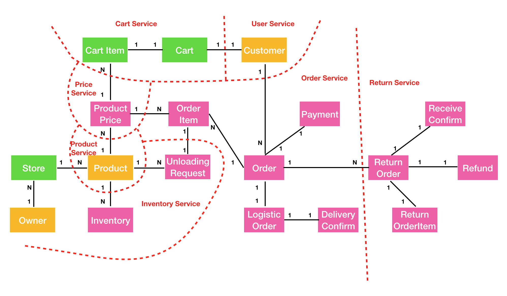
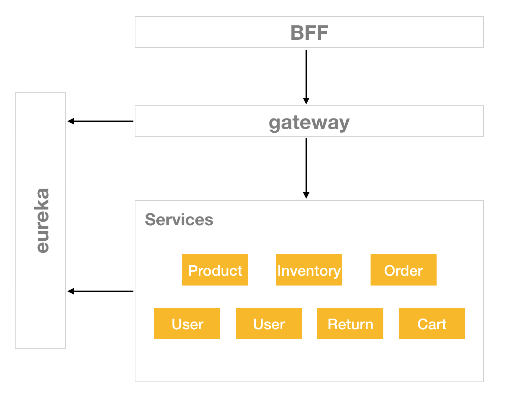

## Shopify Tasking (BE: 875min/ FE: 690min/ Deploy: 210min)

### Scaffolding
+ backend 30min
+ micro fontend 4h

### eureka server (30min 5min)

### User Service (BE: 120min)
+ Spike OAuth 1h
+ Implementation 1h 2d

### Product Service (BE: 35min/ FE: 60min)
1. business logic
	+ [x] POST `/products` 15min 20min
	+ [x] GET `/products` 10min 6min
	+ [x] GET `/products/{product_id}` 10min 5min
2. front end lib
	+ [x] `<create-product>` element 30min 16min
	+ [x] `<product-list>` element 30min 10min
	+ [x] `<product-select>` element 30min 10min + 27min(v-model)

### Price Service (BE: 35min/ FE: 60min)
1. business logic
	+ [x] POST `/product-prices` 15min 13min
	+ [x] GET `/product-prices?productId=` 10min 5min
	+ [x] GET `/product-prices/{price_id}` 10min 5min
	+ [x] GET `/product-prices/latest` 10min 13min
2. front end lib
	+ [x] `<create-product-price>` element 30min 10min
	+ [x] `<product-prices>` element 30min 10min

### Inventory Service (BE: 140min/ FE: 210min)
1. business logic
	+ [x] POST `/stores` 15min 27min (mock principal)
	+ [x] GET `/stores` 10min 6min
	+ [x] GET `/stores/{store_id}` 10min 4min
	+ POST `/stores/{store_id}/products/{prodcut_id}/inventories` 15min
	+ GET `/stores/{store_id}/products/{prodcut_id}/inventories/{inv_id}` 10min
	+ POST `/stores/{store_id}/products/{prodcut_id}/loadings` 15min
	+ GET `/stores/{store_id}/products/{prodcut_id}/loadings` 10min
	+ GET `/stores/{store_id}/products/{prodcut_id}/loadings/{loading_id}` 10min
	+ POST `/stores/{store_id}/products/{prodcut_id}/unloading-requests` 15min
	+ GET `/stores/{store_id}/products/{prodcut_id}/unloading-requests/{req_id}` 10min
	+ POST `/stores/{store_id}/products/{prodcut_id}/unloading-requests/{req_id}/confirmation` 10min
	+ POST `/stores/{store_id}/products/{prodcut_id}/unloading-requests/{req_id}/cancellation` 10min
2. front end lib
	+ `<create-store>` 30min
	+ `<store-list>` 30min
	+ `<store>` 30min
	+ `<products>` 30min
	+ `<create-product-loading>` 30min
	+ `<product-loadings>` 30min
	+ `<product-loading>` 30min

### Order Service (BE: 145min/ FE: 180min)
1. business logic
	+ POST `/orders` 30min
	+ GET `/orders` 10min
	+ GET `/orders/{order_id}` 10min
	+ GET `/orders/{order_id}/items` 10min
	+ GET `/orders/{order_id}/items/{item_id}` 10min
	+ POST `/orders/{order_id}/payment` 15min
	+ GET `/orders/{order_id}/payment` 10min
	+ POST `/orders/{order_id}/logistic-order` 15min
	+ GET `/orders/{order_id}/logistic-order` 10min
	+ POST `/orders/{order_id}/logistic-order/confirmation` 15min
	+ GET `/orders/{order_id}/logistic-order/confirmation` 10min
2. front end lib
	+ `<create-order>` 30min
	+ `<create-order-button>` for cart page 30min
	+ `<orders>` 30min
	+ `<order>` 30min
	+ `<payment>` 30min
	+ `<logistic>` 30min

### Return Service (BE: 120min/ FE: 150min/ Deploy: 30min)
1. business logic
	+ POST `/orders` 30min
	+ GET `/orders` 10min
	+ GET `/orders/{order_id}` 10min
	+ GET `/orders/{order_id}/items` 10min
	+ GET `/orders/{order_id}/items/{item_id}` 10min
	+ POST `/orders/{order_id}/receiveConfirmation` 15min
	+ GET `/orders/{order_id}/receiveConfirmation` 10min
	+ POST `/orders/{order_id}/refund` 15min
	+ GET `/orders/{order_id}/refund` 10min
2. front end lib
	+ `<create-return-order>` 30min
	+ `<return-orders>` 30min
	+ `<return-order>` 30min
	+ `<receive-confirmation>` 30min
	+ `<refund>` 30min

### Cart Service (BE: 30min/ FE: 30min)
1. business logic
	+ PUT `/cart` 20min
	+ GET `/cart` 10min
2. front end lib
	+ `<cart>` 30min

### BFF (BE: 250min)
1. [x] POST `/products` 5min
2. [x] GET `/products` 5min
3. [x] GET `/products/{prodcut_id}` 5min
4. [x] *POST `/products/{prodcut_id}/prices` 15min
5. [x] GET `/products/{prodcut_id}/prices/{price_id}` 5min
6. [x] GET `/products/{prodcut_id}/prices/latest` 5min
7. POST `/stores` 5min
8. GET `/stores` 5min
9. GET `/stores/{store_id}` 5min
10. *POST `/stores/{store_id}/products/{prodcut_id}/inventories` 15min
11. GET `/stores/{store_id}/products/{prodcut_id}/inventories/{inv_id}` 5min
12. *POST `/stores/{store_id}/products/{prodcut_id}/loadings` 15min
13. GET `/stores/{store_id}/products/{prodcut_id}/loadings` 5min
14. GET `/stores/{store_id}/products/{prodcut_id}/loadings/{loading_id}` 5min
15. *POST `/stores/{store_id}/products/{prodcut_id}/unloading-requests` 15min
16. GET `/stores/{store_id}/products/{prodcut_id}/unloading-requests/{req_id}` 5min
17. POST `/stores/{store_id}/products/{prodcut_id}/unloading-requests/{req_id}/confirmation` 5min
18. POST `/stores/{store_id}/products/{prodcut_id}/unloading-requests/{req_id}/cancellation` 5min
19. *POST `/orders` 15min
20. GET `/orders` 5min
21. GET `/orders/{order_id}` 5min
22. GET `/orders/{order_id}/items` 5min
23. GET `/orders/{order_id}/items/{item_id}` 5min
24. POST `/orders/{order_id}/payment` 5min
25. GET `/orders/{order_id}/payment` 5min
26. POST `/orders/{order_id}/logistic-order` 5min
27. GET `/orders/{order_id}/logistic-order` 5min
28. POST `/orders/{order_id}/logistic-order/confirmation` 5min
29. GET `/orders/{order_id}/logistic-order/confirmation` 5min
30. *POST `/orders/{order_id}/return-orders` 15min
31. GET `/orders/{order_id}/return-orders` 5min
32. GET `/orders/{order_id}/return-orders/{return_id}` 5min
33. GET `/orders/{order_id}/return-orders/{return_id}/items` 5min
34. GET `/orders/{order_id}/return-orders/{return_id}/items/{item_id}` 5min
35. POST `/orders/{order_id}/return-orders/{return_id}/receiveConfirmation` 5min
36. GET `/orders/{order_id}/return-orders/{return_id}/receiveConfirmation` 5min
37. POST `/orders/{order_id}/return-orders/{return_id}/refund` 5min
38. GET `/orders/{order_id}/return-orders/{return_id}/refund` 5min